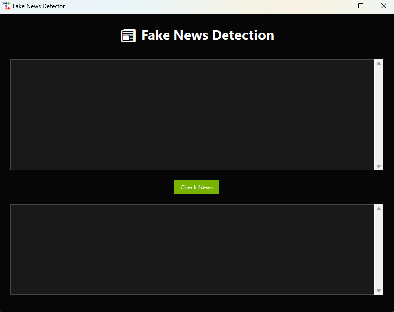

🚀 Features
- Preprocessing of text data (tokenization, stopwords removal, TF-IDF).
- Machine Learning model training and evaluation.
- GUI (Tkinter) for easy user interaction.
- Organized project structure with `src/`, `data/`, and `models/`.

---

📂 Project Structure
```
FakeNewsDetection/
│
├── data/ # Training dataset (CSV files)
├── models/ # Saved ML models (artifacts.pkl)
├── src/ # Source code
│ ├── train_model.py # Model training script
│ └── app.py # GUI application
├── requirements.txt # Python dependencies
└── README.md # Project documentation
```


---

🛠️ Installation & Setup
1. Clone the repository:
```
git clone https://github.com/ovejit-paul/FakeNewsDetection.git
cd FakeNewsDetection
```
2. Create a virtual environment (optional but recommended):
```
python -m venv venv
source venv/bin/activate  # For Linux/Mac
venv\Scripts\activate     # For Windows
```
3. Install dependencies:
```
pip install -r requirements.txt
```
4. Train the model (if not already trained):
```
python src/train_model.py --data data/combined.csv --out models/artifacts.pkl
```
5. Run the GUI app:
```
python src/app.py
```
📸 Demo Screenshot
Here’s how the Fake News Detection GUI looks:


